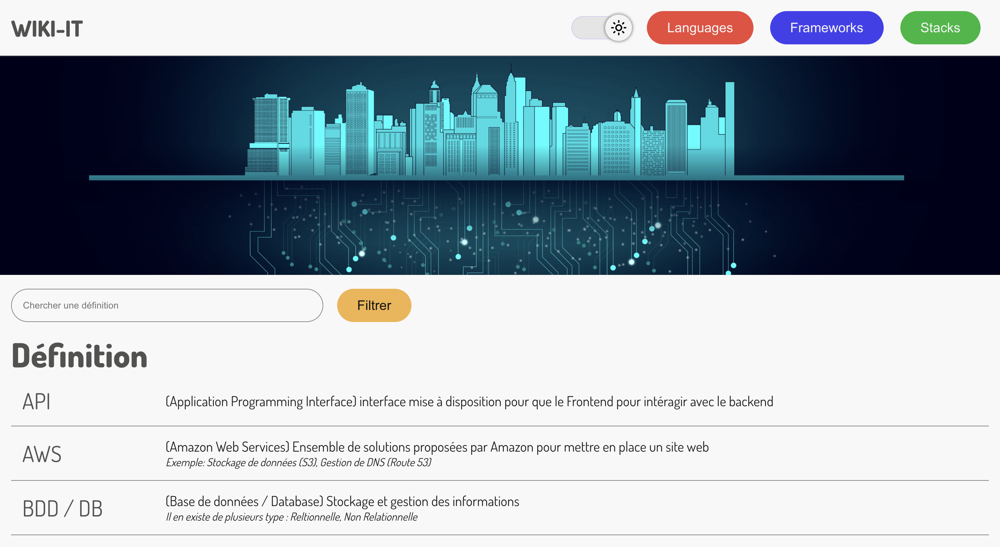

# WIKI-IT

This project show languages, frameworks or stacks use in the IT world.

You can find definitions are present to help you to understand the strange developer language.

## Languages page

You have access to a dedicated page for languages.

For each language you will find:
* Framework(s)
* Why it's used
* If it's more frontend, backend or both
* Adantage(s)
* Disavantage(s)

## Frameworks page

You have access to a dedicated page for frameworks.

For each frameworks you will find:
* Language(s)
* Why it's used
* If it's more frontend, backend or both
* Adantage(s)
* Disavantage(s)

## Stacks page

You have access to a dedicated page for developper stacks.

For each frameworks you will find:
* Language(s)/Framework(s)
* Type of stacks
* Adantage(s)
